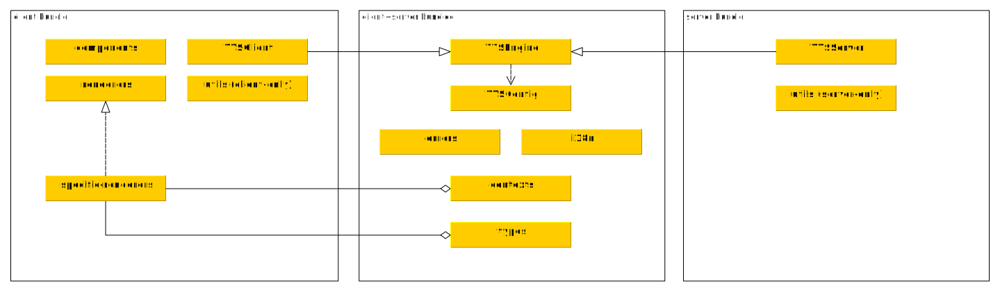

# lea.online core library

This library includes the most common reusable components, which are involved
across (nearly) all lea.online applications.

The package is splitted into server and client exports, so they won't interfere
with one another. However, there is also common (shared) contents,
that is part of both exports.

## Table of Contents

<!-- START doctoc generated TOC please keep comment here to allow auto update -->
<!-- DON'T EDIT THIS SECTION, INSTEAD RE-RUN doctoc TO UPDATE -->

- [Architecture overview](#architecture-overview)
- [This creates coupling](#this-creates-coupling)
- [Installation and initialization](#installation-and-initialization)
- [Component overview](#component-overview)
  - [Common / isomporph](#common--isomporph)
    - [Errors](#errors)
    - [i18n](#i18n)
    - [utils](#utils)
  - [Client-only](#client-only)
    - [TTSCLient](#ttsclient)
    - [Components (Templates)](#components-templates)
    - [Renderers (Templates)](#renderers-templates)
- [Testing](#testing)
- [License](#license)

<!-- END doctoc generated TOC please keep comment here to allow auto update -->

## Architecture overview

The following overview tries to summarize this relationship:



## This creates coupling

Yes and no. On the one hand it clearly couples apps to this library. On the
other hand this is just a reference implementation for common behavior in the
apps. Many apps will have to use the same TTS engine but are not forced to, they
could also implement their own. Since our apps currently all run on NodeJs +
Meteor we use this library in all of them.

Second, the apps don't import the whole library but only those modules that
are used in separate files.

## Installation and initialization

Install this on your lea.online app via

```bash
meteor add leaonline:corelib
```

Beware to import (export) files separately, for example:

*`imports/contexts/Unit.js`*

```javascript
import { Unit } from 'meteor/leaonline:corelib/contexts/Unit'

Unit.methods = Unit.methods || {}

// add a custom, app-specific method definition


Unit.methods.foo = {
  name: 'unit.methods.foo',
  schema: { bar: String },
  run: function ({ bar }) {
    // ... logic
  }
}

export { Unit }
```

or simply `export` (in case there are no additions to make) via

```javascript
export { Unit } from 'meteor/leaonline:corelib/contexts/Unit'
```

## Component overview

### Common / isomporph

Common refers to code, that is shared among **server and client**.

#### Errors

We use for common / generic errors some custom classes that extend `Meteor.Error` to increase DRY

#### i18n

Translation wrapper (currently using `ostrio:i18n`) including default translations for labels that
are used in this core library. Use `Meteor.settings` to define a "system language" that defaults on the server.

#### utils

Some utilities are shared accross architectures to ensure a good fullstack experience.
The mostly include accounts and architectural utils or check-matchers.

### Client-only

The client part of this package consists of the common / shared

#### TTSCLient

- Wrapper library for the browser's SpeechSynth API, provides a fallback, where a certain tts
  is synthesized on the server and sent to the client as audio stream.

## Testing

To run the tests you can cd into this package and execute the following:

```bash
TEST_WATCH=1 TEST_CLIENT=0 meteor test-packages ./ --driver-package meteortesting:mocha
```

## License

All components of this library are released under MIT license, see [LICENSE](./LICENSE)
